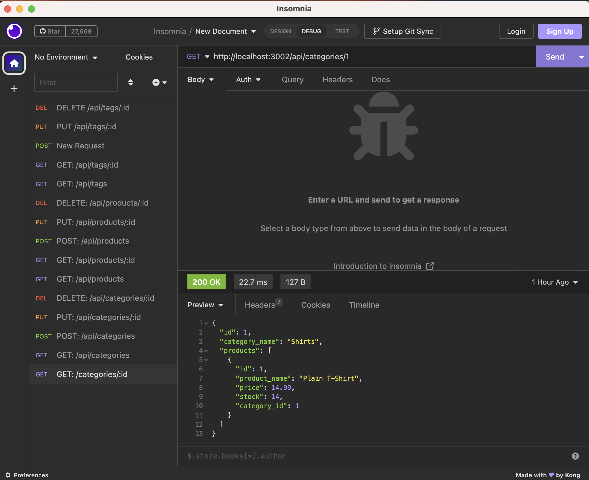

# shop-here-orm-e-commerce-backend

## [Description:](#description)

       This project is an e-commerce backend application built using Express.js and Sequelize to interact with a MySQL database. The purpose of this project is to provide a functional API for an e-commerce website, allowing users to perform CRUD operations on product categories, products, and tags.
       
       The application satisfies a set of technical acceptance criteria, including the ability to connect to a MySQL database, sync Sequelize models to the database, and store sensitive data using environment variables.

       This e-commerce back-end application leverages several coding concepts and technologies to build its functionality. It uses Node.js as the runtime environment and Express.js as the web application framework to create a RESTful API. It also uses Sequelize as the ORM (Object Relational Mapping) library to interact with a MySQL database. Additionally, the application utilizes the dotenv package to store sensitive data, such as MySQL username and password, and the mysql2 package to connect to the MySQL database. This application also features model associations to create relationships between tables and provides the ability to perform CRUD operations (Create, Read, Update, Delete) using RESTful routes. 

## [Table of Contents:](#table-of-contents:)
   
- [Description](#description)
- [Installation](#installation)
- [Usage](#usage)
- [License](#license)
- [Contributing](#contributing)
- [Tests](#tests)
- [Questions](#questions)
   
## [Installation:](#installation:)

    Prior to using the application:

    * clone the repository and install the required dependencies with npm install or npm i

    These are the dependencies you should:
     * Node.js:
        A JavaScript runtime environment that executes JavaScript code outside of a web browser.

     * MYSQL2:
        A MySQL database driver for Node.js that enables interaction with MySQL databases

    * Sequelize: 
        An Object Relational Mapping (ORM) library that provides an easier way to interact with databases by representing database tables as JavaScript objects.

     * Express.js:
        A web framework that allows for easy creation of RESTful APIs.

    * dotenv:
        A zero-dependency module that loads environment variables from a .env file into process.env. This makes it easy to keep sensitive information like API keys and database passwords out of code and safely stored in an environment file.
 
## [Usage:](#usage:)

    To use this e-commerce back-end application, you'll need to make sure you first cloned the repository to your local machine and installed the required dependencies by running npm install or npm i, then follow the steps below:

    * create a new .env file at the root of the project and add your MYSQL credentials (DB_NAME, DB_USR, and DB_PW).

    * Connect to MySQL database With your own database credentials; $ mysql -u root -p
    
    * Create the database schema mysql> source db/schema.sql;
    
    * Exit the database mysql> exit
    
    * Populate the database $ npm run seed
    
    * Start the server $ npm start

    * Use an application like Insomnia or Postman to test the API routes, which include:

        * GET routes for all categories, products and tags
        * GET routes for a single category, product, or tag by ID.
        * POST, PUT, and DELETE routes for categories, products, and tags.
    
    * When done testing you can stop the application by pressing CTRL + C in your terminal.

Example of testing a route in Insomnia:

    To access the Github Repository visit:
       https://github.com/CarolinaRaIs/shop-here-orm-e-commerce-backend

    To access the deployed site visit:
        https://carolinarais.github.io/shop-here-orm-e-commerce-backend/ 

## [License:](#license:)

       This project is licensed under the ISC license.
   
## [Contributing:](#contributing:)

       Contributions are welcome and encouraged for this project. If you find any issues or have any suggestions for new features, please open an issue or submit a pull request. Before submitting a pull request, please ensure that your code adheres to the project's coding guidelines and has appropriate test coverage. Thank you for your interest in contributing to this project!  
   
## [Tests:](#tests:)

       I encourage contributors to thoroughly explore the code and test it to ensure its functionality. Any feedback or suggestions regarding the testing process are welcomed and appreciated.
   
## [Questions:](#questions:)

       If you have any questions about the repo you can open an issue.

**If more questions arise you can also contact CarolinaRaIs at determination28@gmail.com**
   

       
------------------------------------------------------------------------------------------------
   
This README was generated by [CarolinaRaIs](https://github.com/CarolinaRaIs)